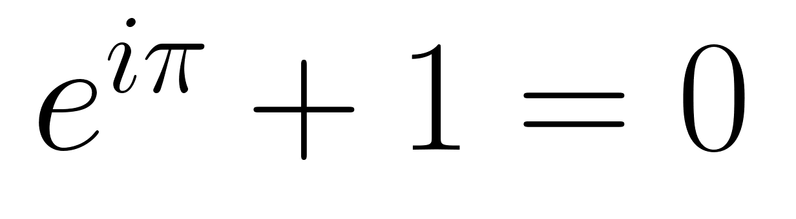
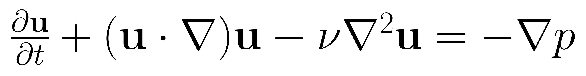
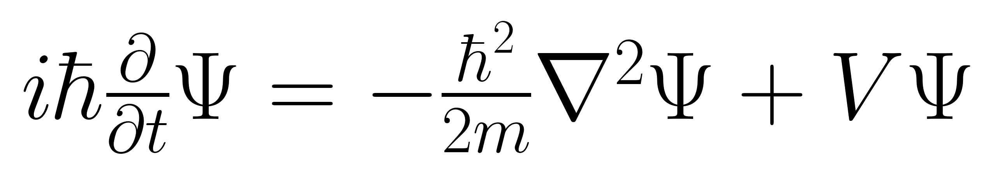
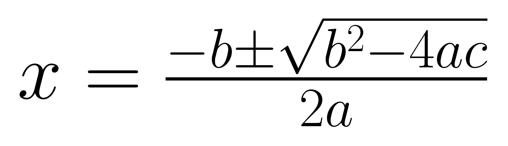

# LaTeX Image Generator

## Motivation

I often found myself manually taking screenshots of LaTeX formulas on Overleaf's "scratch paper" to quickly visualize a given equation. This manual process became cumbersome and inspired the creation of this simple script to automatically generate images of LaTeX formulas right from the terminal.

## Installation

1. **Clone the repository**:
   ```bash
   git clone git@github.com:tonyfu97/latex-image-generator.git
   cd latex-image-generator
   ```

2. **Install the required libraries**:
   ```bash
   pip install matplotlib
   ```

3. **Make the script executable**:
   ```bash
   chmod +x latex_img.py
   ```

4. **Optionally, create a symlink to use the script from anywhere**:
   ```bash
   sudo ln -s "$(pwd)/latex_img.py" /usr/local/bin/latex_img
   ```

## Usage

After following the installation steps, you can use the script as follows:

```bash
latex_img "e^{i\pi} + 1 = 0" "Euler-Id"
```



This will create an image `Euler-Id.png` in the current directory, containing the given formula. If we did not specify the second argument (the image name), the image would be named `formula.png` by default.

## Requirements

- Python 3
- LaTeX installation (for rendering LaTeX formulas with matplotlib)

## Other Examples

### Navier-Stokes Equation

```bash
latex_img "\frac{\partial \mathbf{u}}{\partial t} + (\mathbf{u} \cdot \nabla) \mathbf{u} - \nu \nabla^2 \mathbf{u} = -\nabla p" "Navier-Stokes"
```


### Schrödinger Equation

```bash
latex_img "i\hbar\frac{\partial}{\partial t}\Psi = -\frac{\hbar^2}{2m}\nabla^2\Psi + V\Psi" "Schrodingers"
```


### Quadratic Formula

```bash
latex_img "x = \frac{{-b \pm \sqrt{{b^2 - 4ac}}}}{{2a}}" "quadratic"
```

